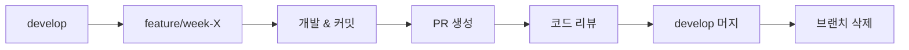

# Git Workflow - Lostvin Calendar

> **목적**: 체계적인 브랜치 관리 및 배포 전략
>
> **원칙**: Week 단위 개발, 명확한 커밋 메시지, 안전한 배포

---

## 🌿 브랜치 전략

### 주요 브랜치

```
main (프로덕션)
  ↑
develop (개발)
  ↑
feature/week-X-[name] (기능 개발)
```

### 브랜치 설명

| 브랜치 | 용도 | 머지 대상 | 삭제 |
|--------|------|-----------|------|
| `main` | 프로덕션 배포용 | - | ❌ 절대 삭제 금지 |
| `develop` | 개발 통합 브랜치 | `main` | ❌ 절대 삭제 금지 |
| `feature/week-X-[name]` | Week별 기능 개발 | `develop` | ✅ 머지 후 삭제 |
| `hotfix/[name]` | 긴급 버그 수정 | `main`, `develop` | ✅ 머지 후 삭제 |

---

## 📝 브랜치 네이밍 규칙

### Feature 브랜치

```bash
feature/week-[주차번호]-[간단한-설명]
```

**예시**:
```bash
feature/week-0-tech-validation    # Week 0: 기술 검증
feature/week-1-project-setup      # Week 1: 프로젝트 기반
feature/week-2-calendar-renderer  # Week 2: 달력 렌더링
feature/week-3-holidays-ui        # Week 3: 공휴일 & 설정 UI
feature/week-4-pdf-url-share      # Week 4: PDF & URL 공유
```

### Hotfix 브랜치

```bash
hotfix/[이슈-번호]-[간단한-설명]
```

**예시**:
```bash
hotfix/42-pdf-font-crash          # 이슈 #42: PDF 폰트 크래시
hotfix/holiday-fetch-error        # 공휴일 fetch 에러 수정
```

---

## 🔄 개발 워크플로우

### Week별 개발 사이클



### 1. 새로운 Week 시작

```bash
# develop 브랜치 최신화
git checkout develop
git pull origin develop

# 새 feature 브랜치 생성
git checkout -b feature/week-2-calendar-renderer

# 첫 커밋 (Week 시작 마크)
git commit --allow-empty -m "Start Week 2: Calendar Renderer"
git push -u origin feature/week-2-calendar-renderer
```

### 2. 개발 중 커밋

```bash
# 작업 파일 추가
git add src/lib/calendar/generator.ts

# 커밋 (커밋 메시지 규칙 준수)
git commit -m "feat: Add generateYearlyCalendar function"

# 푸시
git push
```

### 3. Week 완료 후 PR 생성

```bash
# 마지막 푸시
git push

# GitHub에서 PR 생성
# Title: [Week 2] Calendar Renderer
# Base: develop ← Compare: feature/week-2-calendar-renderer
```

### 4. 머지 및 정리

```bash
# PR이 develop에 머지되면
git checkout develop
git pull origin develop

# feature 브랜치 삭제
git branch -d feature/week-2-calendar-renderer
git push origin --delete feature/week-2-calendar-renderer
```

---

## 💬 커밋 메시지 규칙

### Conventional Commits

```
<type>(<scope>): <subject>

<body>

<footer>
```

### Type 목록

| Type | 용도 | 예시 |
|------|------|------|
| `feat` | 새로운 기능 | `feat: Add yearly calendar component` |
| `fix` | 버그 수정 | `fix: Resolve PDF Korean font issue` |
| `docs` | 문서 수정 | `docs: Update README with setup guide` |
| `style` | 코드 포맷팅 (기능 변경 없음) | `style: Format code with Prettier` |
| `refactor` | 리팩토링 | `refactor: Extract calendar logic to lib` |
| `test` | 테스트 추가/수정 | `test: Add tests for date utils` |
| `chore` | 기타 (빌드, 패키지 등) | `chore: Update dependencies` |
| `perf` | 성능 개선 | `perf: Optimize calendar rendering` |

### Scope (선택)

- `calendar` - 달력 관련
- `holidays` - 공휴일 관련
- `pdf` - PDF 생성 관련
- `ui` - UI 컴포넌트
- `settings` - 설정 관련

### 예시

**좋은 커밋 메시지**:
```bash
feat(calendar): Add generateYearlyCalendar function

- 12개월 데이터 생성
- 윤년 처리 포함
- 주 시작 요일 옵션 지원

Closes #15
```

**나쁜 커밋 메시지**:
```bash
update
fix bug
WIP
asdf
```

---

## 🔍 Pull Request 규칙

### PR 제목

```
[Week X] 간단한 설명
```

**예시**:
```
[Week 2] Calendar Renderer
[Week 4] PDF Generation & URL Sharing
[Hotfix] Fix Korean font in PDF
```

### PR 설명 템플릿

```markdown
## 📝 변경 내용

- [ ] 달력 렌더링 엔진 구현
- [ ] 연간 달력 컴포넌트
- [ ] 월간 달력 컴포넌트
- [ ] 레이아웃 시스템 (A4/A3)

## 🎯 관련 이슈

Closes #15, #16

## 🧪 테스트

- [ ] 연간 달력 렌더링 확인
- [ ] 윤년 처리 확인
- [ ] 주 시작 요일 변경 확인

## 📸 스크린샷

(스크린샷 첨부)

## 📋 체크리스트

- [ ] ESLint 에러 0개
- [ ] TypeScript 컴파일 에러 0개
- [ ] 테스트 작성 완료
- [ ] CODING_STANDARDS.md 준수
- [ ] SHARED_COMPONENTS.md 업데이트 (필요 시)
```

### PR 리뷰 프로세스

1. **Self Review**: PR 올리기 전 자가 점검
2. **Code Review**: 팀원 리뷰 (혼자면 생략 가능)
3. **테스트**: 로컬에서 동작 확인
4. **머지**: `develop`에 머지
5. **브랜치 삭제**: feature 브랜치 삭제

---

## 🚀 배포 전략

### develop → main 머지

```bash
# develop이 안정적일 때 main으로 머지
git checkout main
git pull origin main

git merge develop
git push origin main

# 태그 생성 (버전 관리)
git tag -a v0.1.0 -m "Week 2 완료: Calendar Renderer"
git push origin v0.1.0
```

### Vercel 자동 배포

- `main` 브랜치 푸시 시 자동 배포
- `develop` 브랜치는 Preview 배포
- PR별로도 Preview URL 생성

---

## 🔥 Hotfix 워크플로우

### 긴급 버그 발견 시

```bash
# main 브랜치에서 hotfix 브랜치 생성
git checkout main
git pull origin main
git checkout -b hotfix/pdf-font-crash

# 버그 수정
git add .
git commit -m "fix(pdf): Resolve Korean font crash issue"
git push -u origin hotfix/pdf-font-crash

# PR 생성 (main으로)
# Title: [Hotfix] Fix PDF Korean font crash

# 머지 후 develop에도 적용
git checkout develop
git merge hotfix/pdf-font-crash
git push origin develop

# hotfix 브랜치 삭제
git branch -d hotfix/pdf-font-crash
git push origin --delete hotfix/pdf-font-crash
```

---

## 📊 Week별 브랜치 현황

### 진행 중

| Week | 브랜치 | 상태 | 완료 예정 |
|------|--------|------|-----------|
| - | - | - | - |

### 완료

| Week | 브랜치 | 머지 날짜 | 태그 |
|------|--------|-----------|------|
| - | - | - | - |

---

## 🛡️ 브랜치 보호 규칙

### main 브랜치

- ✅ 직접 푸시 금지
- ✅ PR을 통해서만 머지 가능
- ✅ 리뷰 승인 필요 (팀 프로젝트 시)
- ✅ CI 통과 필수

### develop 브랜치

- ✅ 직접 푸시 금지
- ✅ PR을 통해서만 머지 가능
- ✅ CI 통과 필수

### feature 브랜치

- ❌ 제한 없음 (자유롭게 커밋)

---

## 🔧 Git 설정

### .gitignore

```bash
# 의존성
/node_modules
/.pnp
.pnp.js

# 빌드
/.next/
/out/
/build

# 환경 변수
.env*.local
.env

# 기타
.DS_Store
*.pem
npm-debug.log*
yarn-debug.log*
yarn-error.log*

# 테스트
/coverage

# TypeScript
*.tsbuildinfo
next-env.d.ts

# Vercel
.vercel
```

### .gitattributes

```bash
# 줄바꿈 자동 변환
* text=auto

# 특정 파일은 LF로 고정
*.sh text eol=lf

# 바이너리 파일
*.png binary
*.jpg binary
*.pdf binary
```

---

## 📚 참고 명령어

### 자주 사용하는 Git 명령어

```bash
# 브랜치 목록
git branch -a

# 브랜치 전환
git checkout develop

# 원격 브랜치 삭제
git push origin --delete feature/week-2-calendar-renderer

# 커밋 로그 보기
git log --oneline --graph --all

# 마지막 커밋 수정 (푸시 전)
git commit --amend

# 변경사항 임시 저장
git stash
git stash pop

# 특정 파일만 커밋 취소
git reset HEAD <file>

# develop 최신화 + 현재 브랜치 rebase
git checkout develop
git pull
git checkout feature/week-2-calendar-renderer
git rebase develop
```

---

## 🚨 주의사항

### ❌ 절대 하지 말 것

1. **main 브랜치에 직접 푸시**
   ```bash
   # ❌ 금지
   git checkout main
   git push origin main
   ```

2. **force push (협업 시)**
   ```bash
   # ❌ 금지 (혼자 작업 시에만 허용)
   git push -f origin feature/week-2
   ```

3. **민감한 정보 커밋**
   ```bash
   # ❌ .env 파일, API 키 등
   ```

4. **의미 없는 커밋 메시지**
   ```bash
   # ❌ 금지
   git commit -m "update"
   git commit -m "fix"
   git commit -m "WIP"
   ```

### ✅ 권장 사항

1. **커밋은 작게, 자주**
   - 하나의 기능 = 하나의 커밋
   - 50줄 이하 변경 권장

2. **커밋 전 테스트**
   ```bash
   npm run lint
   npm run type-check
   npm run test
   ```

3. **PR 전 develop 최신화**
   ```bash
   git checkout develop
   git pull
   git checkout feature/week-2
   git merge develop
   ```

---

## 📖 참고 문서

- [Conventional Commits](https://www.conventionalcommits.org/)
- [GitHub Flow](https://guides.github.com/introduction/flow/)
- [plans/FINAL_ROADMAP.md](./plans/FINAL_ROADMAP.md)

**마지막 업데이트**: 2025-11-29
